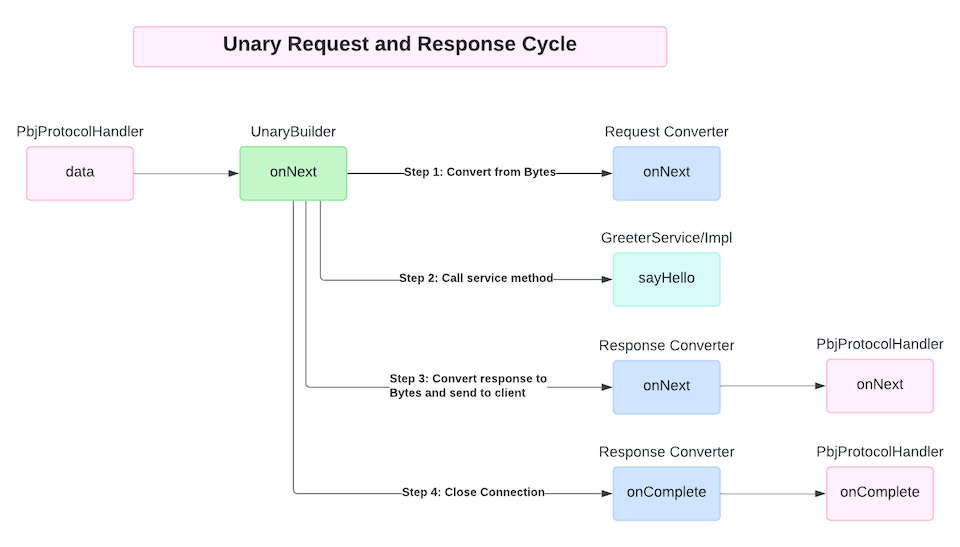
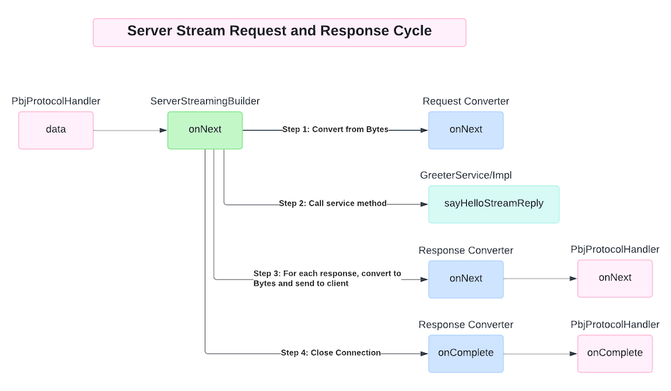
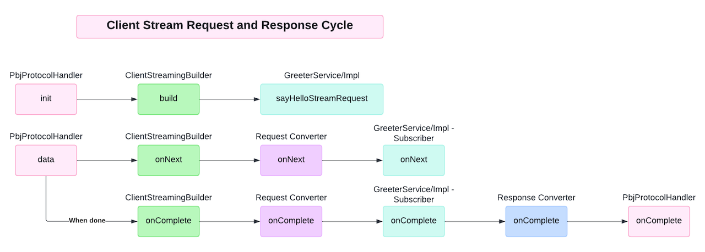
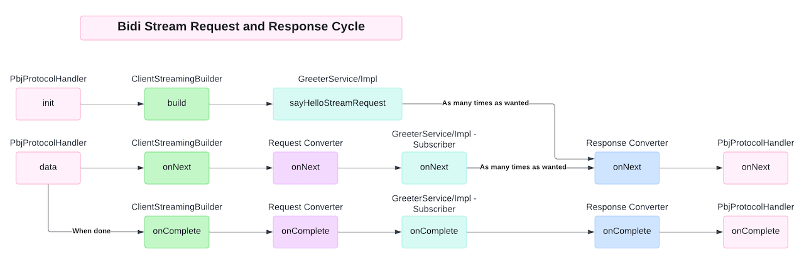

# Architectural Design

An implementation of gRPC for the PBJ runtime, using Helidon Nima, Java 21, and Virtual Threads.

## Rationale

gRPC is based on HTTP2([HTTP2 grpc protocol](https://github.com/grpc/grpc/blob/master/doc/PROTOCOL-HTTP2.md)). Helidon
provides a very good HTTP2 implementation based on Virtual Threads, replacing the need to use NIO by providing a
lightweight thread per connection request. With Helidon Nima, an entirely new webserver was written with minimal 3rd
party dependencies. The code is clean and easy to understand.

Helidon comes with a gRPC module based on the official gRPC implementation. It is possible to combine PBJ with the
`grpc.io` libraries, however, the `grpc.io` libraries are large, especially in relation to the size of Helidon Nima
itself. One of the primary objectives of PBJ is to minimize the size and number of dependencies. In addition, it makes
little sense to bolt PBJ onto `grpc.io` and its expectations of what is generated by `protoc`, since PBJ is an
alternative to `protoc`. While that is a decent way to bootstrap the use of PBJ on a server that doesn't support PBJ
directly, in the case of Helidon, we can do better.

Plugins or modules for other webservers can also be created if desired.

## Design

Any user should be able to take a standard Helidon deployment, and include the `pbj-grpc-helidon` module as a
dependency, and that should be enough for them to start using PBJ for gRPC. Helidon supports this model. Helidon is
broken down into modules, where each is a proper JPMS module. Helidon uses the
[ServiceLoader](https://docs.oracle.com/en/java/javase/21/docs/api/java.base/java/util/ServiceLoader.html)
for loading the module classes. Critically, their modules are designed to be pluggable. This allows us to simply
provide our own module, and Helidon will load it and use it.

Once `pbj-grpc-helidon` is on the module path, an application developer may create their Helidon server using the PBJ
"routing". For example:

```java
public static void main(String[] args) {
    WebServer.builder()
            .port(8080)
            .addRouting(PbjRouting.builder().service(new GreeterServiceImpl()))
            .build()
            .start();
}
```

A "routing" is a way to define how requests are handled. A "service" corresponds to a `service` in a protobuf definition
file. This `GreeterServiceImpl` is an application developer class that implements the specification from the protobuf
definition file.

### ServiceInterface

For each `service` definition in a proto file, the PBJ compiler generates an interface that extends from
`ServiceInterface`. Then, the application developer creates a concrete class that implements this generated interface.

For example, suppose I have the protobuf:

```protobuf
syntax = "proto3";

package greeter;
option java_multiple_files = true;

service Greeter {
  rpc sayHello (HelloRequest) returns (HelloReply) {}
  rpc sayHelloStreamReply (HelloRequest) returns (stream HelloReply) {}
  rpc sayHelloStreamRequest (stream HelloRequest) returns (HelloReply) {}
  rpc sayHelloStreamBidi (stream HelloRequest) returns (stream HelloReply) {}
}

message HelloRequest {
  string name = 1;
}

message HelloReply {
  string message = 1;
}
```

The PBJ compiler will generate classes for `HelloRequest` and `HelloResponse`, and a `GreeterService` interface that
extends `ServiceInterface`. The application developer will then create a concrete class that implements
`GreeterService`. Using default methods in the `ServiceInterface` and/or the generated `GreeterService`, the PBJ
compiler and runtime will do all the heavy lifting. The application developer only needs to implement the business
logic of the various rpc methods.

gRPC defines four different types of RPC calls: unary, client streaming, server streaming, and bidirectional streaming.

#### Unary Calls

A unary call is a simple request/response call. This is modeled in PBJ as a simple method call, where the method takes
the request object, and returns the response object. It may optionally throw a `GrpcException` to indicate an error with
a gRPC error code, or a `RuntimeException` to indicate an internal server error.

#### Streaming Calls

Each of the remaining three types of RPC calls involve streaming. Streaming requires the application developer to deal
with connection termination, cancellation, and error handling. The approach taken by PBJ is similar to that taken in
`grpc.io`, but instead of using a library-specific `StreamObserver` object, PBJ uses implementations of the new reactive
`Flow` API in Java 9 and associated interfaces.

The `Flow` API has three primary methods on a `Flow.Subscriber`:
  - `onNext`: called when a new message is available
  - `onError`: called when an error occurs
  - `onComplete`: called when the processing for this subscriber is complete

It also includes some API for managing flow control, hence the name `Flow`. Each subscriber indicates to the publisher
how many messages it is prepared to receive, and the publisher can then push that many messages (one at a time).

# Implementation Design

This module follows the same general pattern found on the official
[Helidon gRPC module](https://github.com/helidon-io/helidon/tree/main/webserver/grpc/src/main/java/io/helidon/webserver/grpc).
Two classes provided by this module are loaded by Helidon:
- `com.hedera.pbj.grpc.helidon.PbjProtocolConfigProvider`: this is used to provide integration of configuration for
  this module with the Helidon configuration system.
- `com.hedera.pbj.grpc.helidon.PbjProtocolProvider`: the primary integration point, handles HTTP2 requests

The `grpc` package of the PBJ runtime contains two classes to support grpc. These are the `ServiceInterface` and a
utility class called `Pipelines`.

`ServiceInterface` defines common methods related to all service interface implementations. Given any
`ServiceInterface` implementation, you can introspect the service name, the "full name" (that is, the service name
plus whatever "package" it is part of, such as would be used as the HTTP path to the service endpoint), and the list
of methods (along with their names) that make up the service.

Most importantly, the `ServiceInterface` defines the `open` method. This is called at the very beginning of the gRPC
session creation. The `open` method is responsible for creating a `Flow.Subscriber` that will receive messages from
the client. The method also receives the method that will be called, any request options, and the `Flow.Subscriber`
that should be called for `onNext` (sending messages back to the client), `onError` (if there are errors), or
`onComplete` (if the response is complete).

This method may be called many times concurrently from different threads. Because this gRPC implementation is based
on Helidon Nima, each request comes in on a single distinct Virtual Thread.

## Pipelines

The `Pipelines` class is a utility class that provides a way to create a "pipeline" of steps involved in processing
requests and responses. This class is not intended to be used by the application developer. It is used by the code
generated by the PBJ compiler.

Generated code looks something like this:

```java
    @Override
    default Flow.Subscriber<? super Bytes> open(
            final @NonNull RequestOptions options,
            final @NonNull Method method,
            final @NonNull Flow.Subscriber<? super Bytes> replies) {

        final var m = (GreeterMethod) method;
        try {
            switch (m) {
                case sayHello -> {
                    // Simple request -> response
                    return Pipelines.<HelloRequest, HelloReply>unary()
                            .mapRequest(bytes -> parseRequest(bytes, options))
                            .method(this::sayHello)
                            .mapResponse(reply -> createReply(reply, options))
                            .respondTo(replies)
                            .build();
                }
                case sayHelloStreamRequest -> {
                    // Client sends many requests with a single response from the server at the end
                    return Pipelines.<HelloRequest, HelloReply>clientStreaming()
                            .mapRequest(bytes -> parseRequest(bytes, options))
                            .method(this::sayHelloStreamRequest)
                            .mapResponse(reply -> createReply(reply, options))
                            .respondTo(replies)
                            .build();
                }
                case sayHelloStreamReply -> {
                    // Client sends a single request and the server sends many responses
                    return Pipelines.<HelloRequest, HelloReply>serverStreaming()
                            .mapRequest(bytes -> parseRequest(bytes, options))
                            .method(this::sayHelloStreamReply)
                            .mapResponse(reply -> createReply(reply, options))
                            .respondTo(replies)
                            .build();
                }
                case sayHelloStreamBidi -> {
                    // Client and server are sending messages back and forth.
                    return Pipelines.<HelloRequest, HelloReply>bidiStreaming()
                            .mapRequest(bytes -> parseRequest(bytes, options))
                            .method(this::sayHelloStreamBidi)
                            .mapResponse(reply -> createReply(reply, options))
                            .respondTo(replies)
                            .build();
                }
            }
        } catch (Exception e) {
            replies.onError(e);
        }
        return null;
    }
```

Every RPC calls involves the same basic steps:
   1. Parse the request message from the wire format into the appropriate type.
   2. Call the appropriate method on the service implementation.
   3. Convert the response from the service implementation into the wire format.
   4. Send the response back to the client.

The `Pipelines` class provides a way to chain these steps together in a way that is easy to read and understand. There
are four types of pipelines: `unary`, `clientStreaming`, `serverStreaming`, and `bidiStreaming`. Each type has its
own static method on `Pipelines` for creating that kind of pipeline.

Internally, the pipelines use `Flow` classes, primarily `Flow.Subcriber` and `Flow.Subscription`. The `Flow` classes
have support for flow control, cancellation, and error handling.

## Unary Pipeline

A unary call (which is a simple request/response call, or basic function), the application developer could implement a
very simple method like this:

```java
public class GreeterServiceImpl implements GreeterService {
    @Override
    public HelloReply sayHello(HelloRequest request) {
        return HelloReply.newBuilder().setMessage("Hello " + request.getName()).build();
    }
    
    // ... other methods here
}
```

As you can see, the method is trivial. It looks like a normal Java method. The PBJ runtime will handle all the work
to marshal the request and response messages to and from the wire format, using PBJ codecs to do the work. The request
is completed immediately upon return of the method. If any `RuntimeException` is thrown, then an appropriate error
code will be returned to the client.

To have better control over error responses, the application developer can throw a `GrpcException`.

```java
public class GreeterServiceImpl implements GreeterService {
    @Override
    public HelloReply sayHello(@NonNull final HelloRequest request) throws GrpcException {
        if (request.getName().isEmpty()) {
            throw new GrpcException(GrpcStatus.INVALID_ARGUMENT, "Name cannot be empty");
        }
        
        return HelloReply.newBuilder().setMessage("Hello " + request.getName()).build();
    }
    
    // ... other methods here
}
```

Internally, the unary pipeline is implemented with a `Flow.Subscriber` that receives a single message from the client.
It then uses the defined request convert to convert the message from `Bytes` to the appropriate type. The output of
that call is then fed into the service implementation method, which returns the response. This response is then
converted back to `Bytes` and sent back to the client.



## Server Streaming Pipeline

The "server streaming" RPC method is one where a single message is sent from the client to the server, and the server
responds with a stream of messages.

Here is an example, where after receiving a message, the server responds with 10 messages. For this case, the method
signature contains the request object and a `Flow.Subscriber`. PBJ handles converting the request object from `Bytes`
into the appropriate type. The `Flow.Subscriber` is used to send messages back to the client, or terminate the
connection due to errors, or to complete the connection gracefully.

```java
@Override
public void sayHelloStreamReply(
        @NonNull final HelloRequest request,
        @NonNull final Flow.Subscriber<? super HelloReply> replies) {
    for (int i = 0; i < 10; i++) {
        replies.onNext(HelloReply.newBuilder()
                .setMessage("Hello " + request.getName() + " " + i)
                .build());
    }

    replies.onComplete();
}
```

The server streaming pipeline is almost identical to the unary pipeline, except that the `replies` subscriber may be
called multiple times, and is actually exposed to the application developer.



## Client Streaming Pipeline

The "client streaming" RPC method is one where many messages are sent from the client to the server, but only a single
message is sent back from the server to the client at the end.

Here is an example. The client will send a stream of messages, each containing a name. The server will respond with a
message containing the concatenation of all the names. Notice that the method must return a `Flow.Subscription` to
the caller. This is the subscription to which the caller will push each message as it arrives from the client. Since
we can only return a single object from the method, we need a callback into which to push the response message. We
therefore see a `Flow.Subscription` supplied as an argument to the method, even though only a single message can
be sent to the client. Sending more than one message will result in an error.

```java
@Override
@NonNull
public Flow.Subscriber<HelloRequest> sayHelloStreamRequest(@NonNull final Flow.Subscriber<HelloRequest> response) {
    return new Flow.Subscriber<>() {
        private final List names = new ArrayList();

        @Override
        public void onSubscribe(Flow.Subscription subscription) {
            subscription.request(Long.MAX_VALUE); // turn off flow control if you want
        }

        @Override
        public void onNext(HelloRequest item) {
            names.add(item.getName());
        }

        @Override
        public void onError(Throwable throwable) {
            response.onError(throwable);
        }

        @Override
        public void onComplete() {
            response.onNext(HelloReply.newBuilder()
                    .setMessage("Hello " + String.join(", ", names))
                    .build());
            response.onComplete();
        }
    };
}
```

When the client streaming handler is built, it immediately calls the application method for that RPC call. That method
return a `Flow.Subscriber`, F1. Then, as each message is received from the client, the `onNext` method of the request
convert is called, which then calls `onNext` on F1 after converting from `Bytes` to the request object. When F1 calls
any method on the `response` subscriber, the response is converted back to `Bytes` and sent back to the client.



## Bidirectional Streaming Pipeline

Bidirectional stream methods have the same signature as the client streaming methods, but they permit multiple
messages to be returned to the client. The rate at which messages are received from the client and sent to the client
can be arbitrary. For example, one thread may push messages to the client while the request message is receiving
messages from the client. Or each message from the client may trigger a response message to be sent to the client.
How this is handled is up to the application developer.

For example, the following is a bidirectional streaming method, where for every request, there is a response, but
using the same thread. Here you can see that in the method call (`sayHelloStreamBidi`), we receive a `Flow.Subscriber`.
Using the `onNext`, `onError`, and `onComplete` methods of this subscriber we can send messages back to the client,
terminate the connection due to errors, or close the connection gracefully. We also return a new `Flow.Subscriber` that
will receive messages from the client. The PBJ-Helidon module will push messages from the client to this subscriber
using the `onNext` method.

```java
public class GreeterServiceImpl implements GreeterService {
    @Override
    @NonNull
    public Flow.Subscriber<HelloReply> sayHelloStreamBidi(@NonNull final Flow.Subscriber<HelloRequest> replies) {
        return new Flow.Subscriber<>() {
            @Override
            public void onSubscribe(Flow.Subscription subscription) {
                subscription.request(Long.MAX_VALUE); // turn off flow control if you want to
            }

            @Override
            public void onNext(HelloRequest item) {
                replies.onNext(HelloReply.newBuilder()
                        .setMessage("Hello " + item.getName())
                        .build());
            }

            @Override
            public void onError(Throwable throwable) {
                replies.onError(throwable);
            }

            @Override
            public void onComplete() {
                replies.onComplete();
            }
        };
    }
}
```

The bidirectional streaming pipeline is similar to the client streaming pipeline, except that the `replies` subscriber
may be called more than once.



# Test Plan

## Functional Tests

1. `Greeter.sayHello` can be successfully called
2. `Greeter.sayHelloStreamReply` can be successfully called
3. `Greeter.sayHelloStreamRequest` can be successfully called
4. `Greeter.sayHelloStreamBidi` can be successfully called
5. If `Greeter.sayHello` is called with invalid input, a `GrpcException` is thrown and turns into the expected gRPC error on the client
6. If `Greeter.sayHelloStreamReply` is called with invalid input, a `GrpcException` is thrown and turns into the expected gRPC error on the client
7. If `Greeter.sayHelloStreamReply` is called and sends `onError`, the client receives an error and the connection is terminated
8. If `Greeter.sayHelloStreamRequest` is called with invalid input, a `GrpcException` is thrown and turns into the expected gRPC error on the client
9. If `Greeter.sayHelloStreamRequest` is called and sends `onError`, the client receives an error and the connection is terminated
10. If `Greeter.sayHelloStreamBidi` is called with invalid input, a `GrpcException` is thrown and turns into the expected gRPC error on the client
11. If `Greeter.sayHelloStreamBidi` is called and sends `onError`, the client receives an error and the connection is terminated
12. The server passes the standard set of [gRPC tests](https://github.com/grpc/test-infra?tab=readme-ov-files)

## Performance Testing

1. Performance on the server is comparable to other solutions (see [Performance Testing](https://github.com/LesnyRumcajs/grpc_bench/blob/master/java_vertx_grpc_bench/Dockerfile))

## Load Testing

1. If a client attempts to send a massive number of requests to a server, the server will only read as many as flow
   control allows. The server will not crash or run out of memory.
2. The server will limit the number of concurrent requests to a level where it remains stable and responses remain within
   acceptable tolerances.

## Malicious Testing

1. If an attacker attempts to send a massive message during an RPC call, the server will reject the message outright
   and close the connection because it restricts the number of bytes per message.

# Future Work
## Support for gRPC-Web

Web clients are not able to use HTTP2 directly. They must use HTTP1.1. The `grpc.io` project promotes the use of an
Envoy plugin that converts from HTTP1.1 to HTTP2. This is known as `gRPC Web`. This makes the deployment of gRPC
services to the web painful, because now you need to deploy an Envoy proxy in front of your gRPC service. It may be
possible for this one module to support both standard gRPC and gRPC Web. See
[gRPC Web protocols](https://github.com/grpc/grpc/blob/master/doc/PROTOCOL-WEB.md)

## Support the Authority header

gRPC supports authentication using the `Authority` header. Support for this feature will be needed in the future.

## Support Timeouts

In gRPC, the client can specify a timeout. If the request takes longer than the timeout to complete, the server is to
terminate the connection.

## Support Encodings

gRPC supports a variety of encodings. This module only supports `identity` encoding. Support for other encodings such
as gzip, deflate, and snappy may be added later.

## Add metrics

This module should provide a number of useful metrics out of the box, such as the number of times each individual
rcp method is called, and how long each call takes. We should also think about an access long, in which the user agent
is recorded. However, we need to be careful not to hurt performance or stability by logging such information.

## Support Custom Metadata

gRPC allows for custom metadata in the HTTP2 headers. This doesn't seem to be heavily used, but we can implement it
later if required.

## Support for gRPC Reflection

gRPC defines a [reflection API](https://grpc.io/docs/guides/reflection/) that allows clients (such as grpcurl) to
perform gRPC calls in a more ad-hoc human friendly way. This should be supported by the system.
